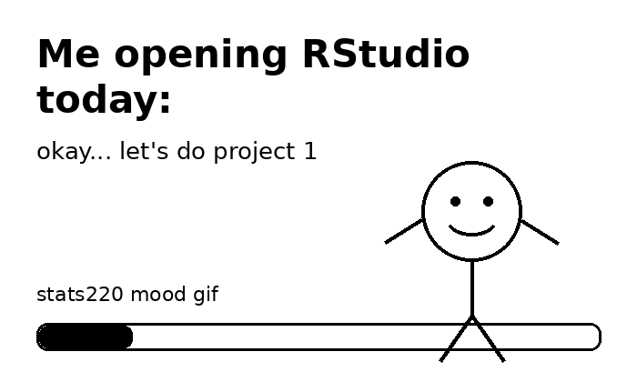

# stats220

This is my repo for **STATS 220**.

## A little about me

Some facts about me:

- I am undertaking a degree in Statistics.
- I am taking STATS 220 because I want to learn more about R coding.
- I am interested in *learning new ways* to work with data.

## About this repo

This repo contains work that I have done in STATS 220.  
It shows some of the things I am learning in this course and is my first online project.

## Project goals

My first project is to create a meme using R and present it in a Markdown file.

Here are some websites related to my learning:

1. [STATS 220 Canvas page](https://canvas.auckland.ac.nz/courses/141163/assignments/484109)
2. [GitHub](https://github.com/)

### My interests

1. Hiking
2. Badminton
3. Reading memes when study gets too stressful

A meme that captures how I currently feel about my university studies is:

